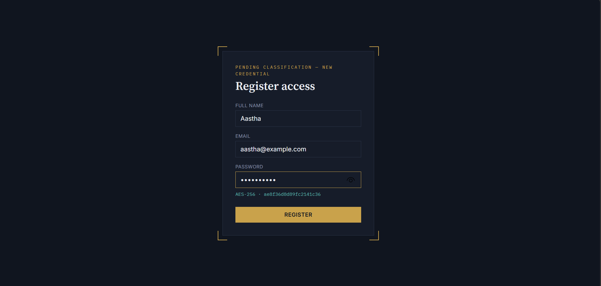
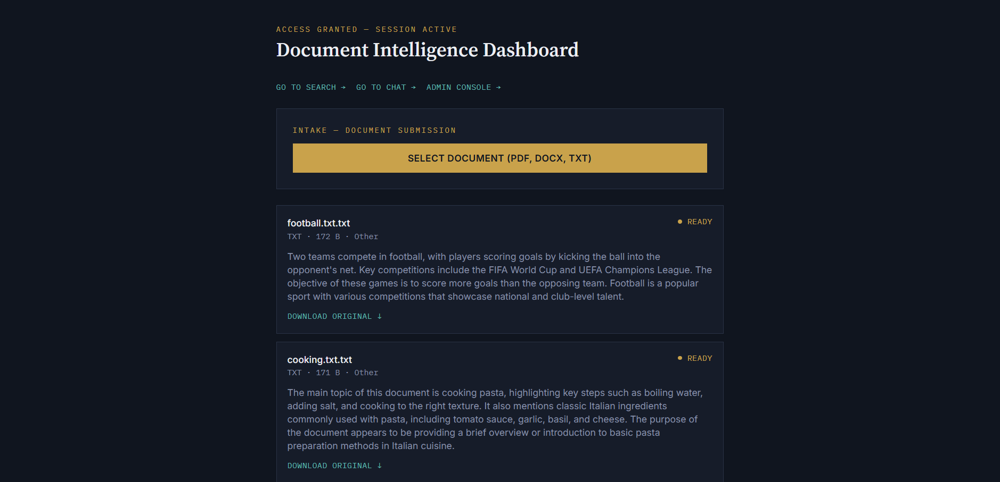
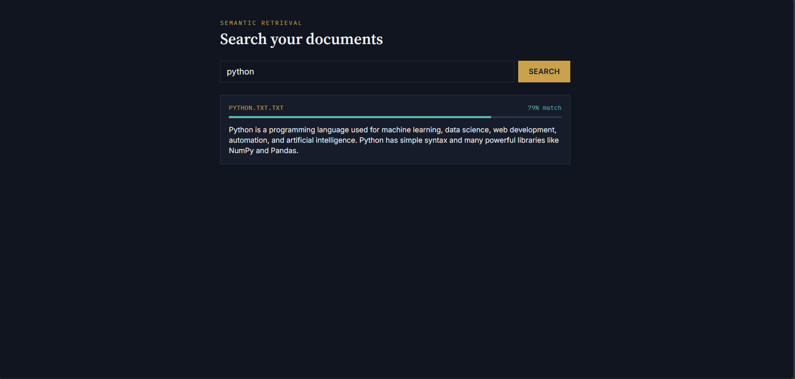
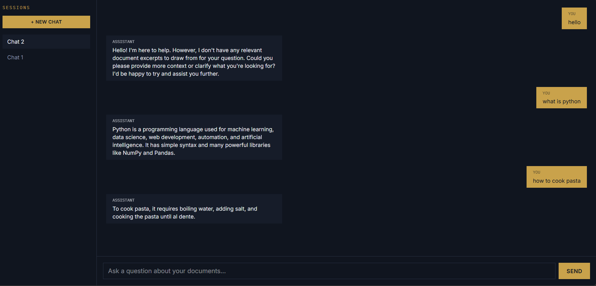
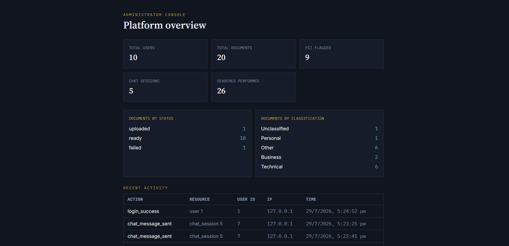

# AI Secure Document Intelligence Platform

A full-stack platform for secure document upload, AI-powered analysis, semantic search, and retrieval-augmented chat — built with FastAPI, React, TypeScript, PostgreSQL, and local open-source AI models (no paid APIs required).

## Features

- **Authentication & RBAC** — JWT-based auth with Admin/User roles, bcrypt password hashing, rate-limited login
- **Secure document storage** — PDF/DOCX/TXT upload with AES (Fernet) encryption at rest
- **Text extraction** — PyMuPDF (PDF), python-docx (DOCX), native parsing (TXT)
- **AI summarization & classification** — via locally-running Ollama (Llama 3.2), with graceful fallback if unavailable
- **PII detection & masking** — spaCy NER + regex, automatically masks emails/phones/names in preview text
- **Semantic search** — Sentence Transformers embeddings + FAISS vector index, with user-scoped, relevance-thresholded results
- **RAG chat** — conversational Q&A grounded in your own documents, with conversation history and explicit "I don't know" handling to avoid hallucination
- **Audit logging** — append-only trail of all sensitive actions, viewable in an admin console
- **Analytics dashboard** — real-time aggregated stats (documents by status/classification, PII counts, activity)
- **Automated test suite** — pytest coverage of auth, RBAC, and cross-user data isolation
- **Dockerized** — full stack (frontend, backend, database) runs with one command

## Screenshots

| Signup | Dashboard |
|---|---|
|  |  |

| Search | Chat |
|---|---|
|  |  |

| Admin Console |
|---|
|  |

## Tech Stack

**Frontend:** React, TypeScript, Tailwind CSS, React Router
**Backend:** FastAPI, SQLAlchemy, Pydantic, python-jose (JWT), Passlib (bcrypt), slowapi (rate limiting)
**Database:** PostgreSQL
**AI/ML:** Ollama (local LLM), Sentence Transformers, FAISS, spaCy (NER)
**Document Processing:** PyMuPDF, pdfplumber, python-docx
**Security:** AES (Fernet) encryption at rest, RBAC, audit logging
**Testing:** pytest
**Deployment:** Docker, Docker Compose, Nginx

## Architecture
Documents are encrypted at rest (Fernet/AES) and only ever decrypted in-memory for processing or authorized download. Text is extracted, chunked, embedded, and indexed in FAISS; PostgreSQL stores metadata and a parallel record linking each chunk to its vector ID. RAG chat retrieves relevant chunks per query (scoped to the requesting user's own documents only) and constructs a grounded prompt instructing the model to admit uncertainty rather than hallucinate.

## Installation

### Option A: Docker (recommended — runs the full stack with one command)
```bash
cd docker
docker compose up --build
```
Visit `http://localhost:3000`. Requires Ollama running on your host machine (`ollama serve`, with `llama3.2` pulled).

### Option B: Manual local development
**Backend:**
```bash
cd backend
python -m venv venv
source venv/Scripts/activate  # Windows
pip install -r requirements.txt
# Create .env with DATABASE_URL, SECRET_KEY, ENCRYPTION_KEY
uvicorn app.main:app --reload
```

**Frontend:**
```bash
cd frontend
npm install
npm run dev
```

**Database:** run `database/schema.sql` against your PostgreSQL instance.

**Ollama:**
```bash
ollama pull llama3.2
ollama serve
```

## Running Tests
```bash
cd backend
pytest tests/ -v
```

## Known Limitations & Future Improvements

- OCR for scanned/image-only PDFs is not implemented — extraction requires a real text layer
- FAISS uses a single flat (brute-force) index across all users, with application-level filtering for isolation — suitable at this scale; a larger system would use per-user indexes or metadata-native filtering
- PII masking uses substring replacement rather than character-offset-based redaction, which could theoretically over-match on very short/common names
- No background job queue — document processing (extraction, summarization, embedding) runs synchronously within the upload request; a production system at scale would move this to a task queue (e.g., Celery) with the existing `processing` status enabling progress polling
- Admin navigation link is shown to all users client-side; access is correctly enforced server-side, but a cleaner UX would hide the link entirely for non-admins via a shared auth context
- No password reset flow implemented

## Security Notes

- Passwords hashed with bcrypt, never stored or logged in plaintext
- Documents encrypted at rest; decrypted only in-memory, never written unencrypted to disk
- All resource access (documents, chat sessions) enforces per-user ownership at the query level, verified via automated tests and manual cross-user isolation testing
- Login rate-limited to 5 attempts/minute per IP
- SQL injection mitigated by consistent use of the SQLAlchemy ORM (no raw string-interpolated queries)

## Author

Built by [Your Name] as a learning project over 30 days, developed with a structured, mentorship-driven approach — every line of code was written and understood individually.